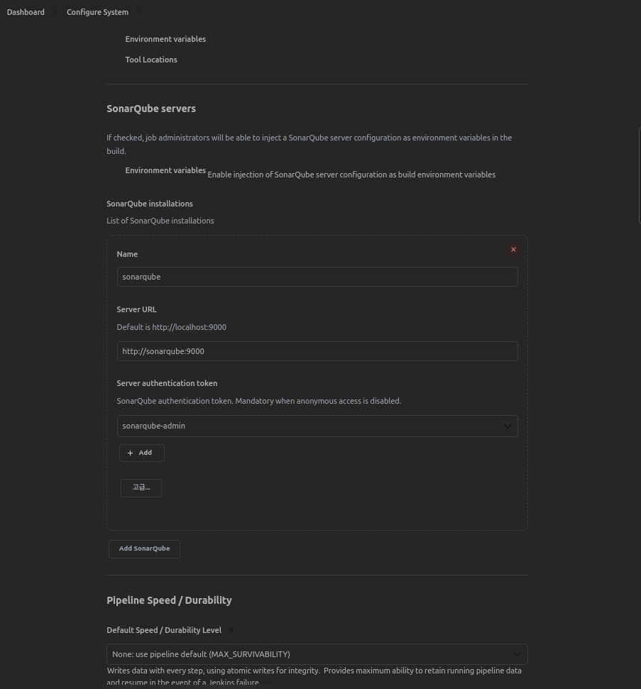

# JaCoCo

[JaCoCo Doc](https://www.jacoco.org/jacoco/)  
[Gradle JacocoTaskExtension](https://docs.gradle.org/current/dsl/org.gradle.testing.jacoco.plugins.JacocoTaskExtension.html#org.gradle.testing.jacoco.plugins.JacocoTaskExtension:excludes)

> JaCoCo is a free code coverage library for Java, which has been created by the EclEmma team based on the lessons learned from using and integration existing libraries for many years.

[[Refer] Gradle 프로젝트에 JaCoCo 설정하기](https://techblog.woowahan.com/2661/)

## Gradle Task 설정

#### jacocoTestReport
- 바이너리 커버리지 결과를 사람이 읽기 좋은 형태의 리포트로 저장
- html 파일로 생성해 사람이 쉽게 눈으로 확인할 수도 있고, SonarQube 등으로 연동하기 위해 xml, csv 같은 형태로도 리포트를 생성할 수 있다.
  
#### jacocoTestCoverageVerification
  - 내가 원하는 커버리지 기준을 만족하는지 확인해 주는 task
  - 예를 들어, 브랜치 커버리지를 최소한 80% 이상으로 유지하고 싶다면, 이 task에 설정하면 된다.
  - test task처럼 Gradle 빌드의 성공/실패로 결과를 보여준다

[JacocoTaskExtension Doc](https://docs.gradle.org/current/dsl/org.gradle.testing.jacoco.plugins.JacocoTaskExtension.html)  
test task에 default로 설정된 값으로, 이 값들은 오버라이드 하여 사용  

```groovy
test {
  jacoco {
    enabled = true
    destinationFile = file("$buildDir/jacoco/$.exec")
    includes = []
    excludes = []
    excludeClassLoaders = []
    includeNoLocationClasses = false
    sessionId = "<auto-generated value>"
    dumpOnExit = true
    classDumpDir = null
    output = JacocoTaskExtension.Output.FILE
    address = "localhost"
    port = 6300
    jmx = false
  }
}
```

test task 이후 jacocoTestReport task와 jacocoTestCoverageVerification task 를 순차적으로 작업하는 것을 하나의 task로 묶음
```groovy
task testCoverage(type: Test) {
    group 'verification'
    description 'Runs the unit tests with coverage'

    dependsOn('test',
            'jacocoTestReport',
            'jacocoTestCoverageVerification')

    tasks['jacocoTestReport'].mustRunAfter(tasks['test'])
    tasks['jacocoTestCoverageVerification'].mustRunAfter(tasks['jacocoTestReport'])
}
```

test task 이후 jacocoTestReport task를 강제한다.  
또한 jacocoTestReport 이후 jacocoTestCoverageVerification를 강제할 수도 있다.
```groovy
test {
    finalizedBy 'jacocoTestReport'
}

// jacocoTestReport {
//     finalizedBy 'jacocoTestCoverageVerification'
// }
```

## 커버리지 기준

JaCoCo는 여러 룰을 위한하는 경우 처음 위반한 룰만 리포팅

### [Element](https://www.eclemma.org/jacoco/trunk/doc/api/org/jacoco/core/analysis/ICoverageNode.ElementType.html)

- BUNDLE (default): 패키지 번들
- PACKAGE: 패키지
- CLASS: 클래스
- SOURCEFILE: 소스파일
- METHOD: 메소드

### [Counter](https://www.eclemma.org/jacoco/trunk/doc/api/org/jacoco/core/analysis/ICoverageNode.CounterEntity.html) ([Doc](https://www.eclemma.org/jacoco/trunk/doc/counters.html))

- LINE: 빈 줄을 제외한 실제 코드의 라인 수
- BRANCH: 조건문 등의 분기 수
- CLASS: 클래스 수
- METHOD: 메소드 수
- INSTRUCTION (default): Java 바이트코드 명령 수. [Java bytecode instruction listings](https://en.wikipedia.org/wiki/List_of_Java_bytecode_instructions)
- COMPLEXITY: 복잡도. 자세한 복잡도 계산은 Coverage Counters – JaCoCo docs 참고

### [Value](https://www.eclemma.org/jacoco/trunk/doc/api/org/jacoco/core/analysis/ICounter.CounterValue.html)

- TOTALCOUNT: 전체 개수
- MISSEDCOUNT: 커버되지 않은 개수
- COVEREDCOUNT: 커버된 개수
- MISSEDRATIO: 커버되지 않은 비율. 0부터 1 사이의 숫자로, 1이 100%.
- COVEREDRATIO (default): 커버된 비율. 0부터 1 사이의 숫자로, 1이 100%.

### Example

> 커버리지 수치는 BigDecimal을 강제.  
> 내가 지정한 유효자리수 까지만 표기가 되며, 그 자리수를 넘어가면 반올림.  
> 샘플에서 설정한 라인 커버리지 80%를 0.80 대신 0.8로 쓰게 되면, 0.42가 아닌 0.4로 표시.  

```groovy
jacocoTestCoverageVerification {
  violationRules {
    rule {
      // 'element'가 없으면 프로젝트의 전체 파일을 합친 값을 기준으로 합니다.
      // 위의 리포트에서 'Total'로 표시된 부분입니다.
      limit {
        // 'counter'를 지정하지 않으면 default는 'INSTRUCTION'
        // 'value'를 지정하지 않으면 default는 'COVEREDRATIO'
        minimum = 0.30
      }
    }

    // 여러 룰을 생성할 수 있습니다.
    rule {
      // 룰을 간단히 켜고 끌 수 있습니다.
      enabled = true

      // 룰을 체크할 단위는 클래스 단위
      element = 'CLASS'

      // 브랜치 커버리지를 최소한 90% 만족시켜야 합니다.
      limit {
        counter = 'BRANCH'
        value = 'COVEREDRATIO'
        minimum = 0.90
      }

      // 라인 커버리지를 최소한 80% 만족시켜야 합니다.
      limit {
        counter = 'LINE'
        value = 'COVEREDRATIO'
        minimum = 0.80
      }

      // 빈 줄을 제외한 코드의 라인수를 최대 200라인으로 제한합니다.
      limit {
        counter = 'LINE'
        value = 'TOTALCOUNT'
        maximum = 200
      }
    }
  }
}
```

## 테스트 제외

> QueryDsl을 사용하면 자동으로 생성되는 구현체인 Q*.class 같은 파일이나, spring-batch 등의 배치 설정 파일 커버리지 체크 제외 필요시  
> excludes로 제외할 클래스명을 지정할 수 있고, 와일드카드(* 과 ?)를 사용.

```groovy
jacocoTestCoverageVerification {
  violationRules {
    rule {
      element = 'CLASS'

      limit {
        counter = 'LINE'
        value = 'TOTALCOUNT'
        maximum = 8
      }

      // 커버리지 체크를 제외할 클래스들
      excludes = [
        '**/Q*.java',
        '**/*Generated.java'
      ]
    }
  }
}
```

  


---

# SonarQube

[SonarQube Doc](https://docs.sonarqube.org/latest/)
[SonarQube for Gradle](https://docs.sonarqube.org/latest/analysis/scan/sonarscanner-for-gradle/)

> SonarQube is an automatic code review tool to detect bugs, vulnerabilities, and code smells in your code. It can integrate with your existing workflow to enable continuous code inspection across your project branches and pull requests.

[[Refer] th-deng/sonarqube-on-gradle-sample](https://github.com/th-deng/sonarqube-on-gradle-sample)
[[Refer] jeeneee/소나큐브(SonarQube) 도입](https://jeeneee.dev/springboot/springboot-2-introduction-of-sonarqube/)

## Run SonarQube in Docker

```bash
chmod +x ./sonarqube-docker/run.sh
./sonarqube-docker/run.sh

ID: admin
PW: admin

TOKEN: b913fa691ddae72728d323eed96834d8312e3996
```

## Setup build.gradle

> 위의 빌드 스크립트에서 sonar.profile을 소나큐브의 default quality gate인 Sonar way로 설정하였는데, 이는 커버리지가 80%가 넘어가야 Pass하는 규칙을 포함한다.  
> 또한, 소나큐브는 새로운 코드에 대해서만 통과/실패를 나누기 때문에 api 모듈이 통과된 것으로 나타나는 것이다.

## Run gradlew

```bash
./gradlew test sonarqube
```


---

# SonarQube in Jenkins

[[Refer] SonarQube 정적분석 및 Jenkins CI/CD 통합](https://waspro.tistory.com/596)

## SonarQube setup

Jenkins에서 Quality Gates 상태 체크를 위한 webhook 설정  
> http://jenkins:8080/sonarqube-webhook/


## Jenkins Plugin

- SonarQube Scanner
- Sonar Quality Gates
- JaCoCo

### Plugin setup

Dashboard > Configure System > SonarQube servers

- SonarQube 사용자 Token을 Secret text 타입으로 생성하여 authentication으로 설정하도록한다.



Dashboard > Global Tool Configuration > SonarQube Scanner

- Install automatically를 체크하여 자동으로 설치하도록 구성한다.


- SonarQube Analysis
  - 대상 SonarQube Server를 지정하여 분석을 진행하는 과정
  - withSonarQubeEnv는 Jenkins 관리 > 시스템 설정에 등록한 SonarQube Server Name과 매핑
- SonarQube Quality Gate
  - SonarQube Server에서 분석 결과를 응답하기까지 대기하도록 하는 Stage, 대기 시간을 지정하여 무한정 대기하는 상태를 방지하도록 함 
  - waitForQualityGate는 Server에서 분석을 완료하고 상태를 반환할때까지 파이프라인을 중단시키는 시간을 지정

## Jenkins Project

### Preparation

- Github Token을 Secret text 타입으로 생성하여 Credentials로 설정하도록한다.


### Setup

- Pipeline 타입의 Project를 생성한다.
- 상세 구성은 아래와 같이 설정하고 실제 Pipeline의 구성 groovy 설정은 소스에서 가져와 반영하도록 한다.


### Example

